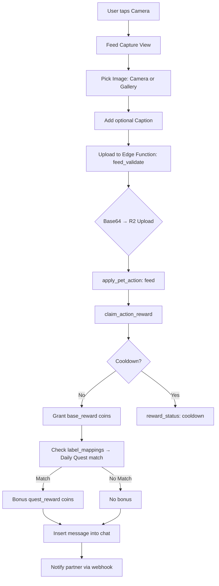

# PicPet Refined - 產品開發企劃書 (Master Plan)

- 版本： v2.1 (Codebase Sync)
- 日期： 2026-02-18
- 項目負責人： NAM
- 技術顧問： Gemini

> [!NOTE]
> This version (v2.1) has been reverse-engineered from the actual codebase & Supabase migrations (latest: `20260216233000_rebalance_mood_decay_and_feed_gain.sql`).
> All listed values are confirmed from source.

---

## 1. 產品概述 (Product Overview)

| Key | Value |
|---|---|
| 產品名稱 | PicPet |
| 核心價值 | 基於「真實相片互動」的社交寵物養成遊戲。異地共養、情感連結、AI 智能反饋。 |
| 目標平台 | iOS & Android (Flutter) |
| 目標市場 | 台灣、香港、日本 (首發) |
| 語言支援 | 繁體中文 (`zh_TW`)、日文 (`ja`)、韓文 (`ko`)、英文 (`en`) |

---

## 2. 用戶系統與配對 (User & Pairing)

### 2.1 帳戶體系

| Feature | Status | Detail |
|---|---|---|
| Google Sign-In | ✅ | `google_sign_in` package |
| Apple Sign-In | ✅ | `sign_in_with_apple` package |
| 匿名登入 | ✅ | Supabase anonymous auth (過渡用) |
| 暱稱 / 頭像 | ✅ | Profile 頁面修改。頭像上傳至 R2 via `avatar_upload` Edge Function |
| 刪除帳號 | ✅ | `delete_account` Edge Function |

### 2.2 房間與配對機制

| Parameter | Value | Source |
|---|---|---|
| 免費版房間上限 | **2** | `_freePlanRoomLimit = 2` (`home_view.dart:159`) |
| Pro 版房間上限 | **∞ (無限)** | `_hasProPlanAccess` 判斷 |
| 超出上限行為 | 房間顯示為 `is_locked`，不可進入 | `room['is_locked'] = !_hasProPlanAccess && i >= _freePlanRoomLimit` |
| 邀請碼 | 後端生成唯一邀請碼 | Room Selection View |

---

## 3. 寵物系統 (Pet System)

### 3.1 寵物種類 (Pet Catalog)

| ID | Name | Accent Color | Assets | Starter |
|---|---|---|---|---|
| `ghost` | Ghost / 幽靈 | `AppTheme.primaryColor` | `ghost_stay.gif`, `ghost_sleep.gif`, `ghost_walking.gif` | ✅ (Default) |
| `cat` | Cat / 貓 | `#FFC27A → #FF9F68` (橘色) | `cat_stay.gif`, `cat_sleep.gif`, `cat_moving.gif` | ❌ |
| `fish` | Fish / 魚 | `#6ED1F2 → #4FB8D9` (藍色) | `fish_stay.gif`, `fish_sleep.gif`, `fish_moving.gif` | ❌ |

- `PetCatalog.defaultPetId = 'ghost'`
- `PetCatalog.colorDnaTypeKey = 'pet_type'` — exists but **not actively used in UI flow** for pet generation.

### 3.2 成長機制 (Leveling)

| Parameter | Value | Source |
|---|---|---|
| 最大等級 | **999** | `kMaxPetLevel = 999` (`leveling.dart:1`) |
| 升級所需 EXP | **50 × 當前等級** | `xpRequiredForNextLevel(level) = 50 * level` |
| 溢出邏輯 | 多餘 EXP 自動升下一級 (`while` loop) | `_applyExpDelta()` (`home_view.dart:935-959`) |
| 滿級行為 | EXP 歸零，進度條 = 100% | `if (nextLevel >= kMaxPetLevel) → nextExp = 0` |
| Debug: Add EXP | +10 per click | Drawer debug tool |

---

## 4. 數值詳細策劃 (Stats & Mechanics)

### 4.1 飽食度 (Hunger)

| Parameter | Value | Source |
|---|---|---|
| 範圍 | **0 – 100** | `hunger = greatest(0, ...)` / `least(100, ...)` |
| 初始值 (新寵物) | — (由 Supabase seed 設定) | `pet_state` table |
| 餵食增量 | **+20 hunger** per feed | `v_hunger := least(100, v_hunger + 20)` |

### 4.2 飽食度衰減 (Hunger Decay)

衰減由 `tick_pet_state` Postgres function 處理，基於 **心情 (mood)** 和 **是否夜間**：

| Mood | Decay Rate (/hour) | Night Rate (/hour) |
|---|---|---|
| `high` | **2** | **1** |
| `mid` | **3** | **1.5** |
| `sad` | **4** | **2** |

- **衰減公式**: `decay = floor(hours_elapsed × decay_rate)`
- **夜間定義**: 本地時區 **00:00 – 07:59** (`v_local_hour between 0 and 7`)
- **時區來源**: `rooms.timezone` 欄位，預設 `UTC`

### 4.3 寵物出走 (Pet Departure)

| Condition | Detail |
|---|---|
| 觸發條件 | `hunger <= 0` |
| 效果 | 顯示出走流程 (`PetDepartureNoteView`)，房間中寵物消失 |
| 召回方式 | 商店購買「Letter」道具 |
| 召回後數值 | `hunger = 40`, `mood_boost = 0`, `mood_boost_expires_at = null` |
| 召回後額外動作 | 呼叫 `tick_pet_state` + `_dispatchNewHungerAlerts` |

### 4.4 飢餓警報 (Hunger Alerts)

| Level | Trigger | System Message Key |
|---|---|---|
| 30 | `hunger <= 30` | `hunger_alert_30::<petName>` |
| 10 | `hunger <= 10` (Urgent) | `hunger_alert_10::<petName>` |

- Alerts 以 system message 方式插入聊天室。
- 前端偵測後顯示 SnackBar (`_showHungerAlertSnackBar`)。

---

## 5. 餵食系統 (Feeding System)

### 5.1 餵食流程



### 5.2 餵食冷卻 (Feed Burst / Cooldown)

| Parameter | Value | Source |
|---|---|---|
| **Burst Window** | **10 minutes** | `v_feed_burst_started_at <= v_now - interval '10 minutes'` |
| 每個 Burst 可成功餵食次數 | **1 次** | `if v_feed_burst_count >= 1 then v_overfed := true` |
| **Overfed 行為** | Hunger **不增加**，記錄 `last_overfed_at` | `v_last_overfed_at := v_now` |
| Overfed UI | 寵物頭上顯示氣泡 **3 秒** | `Timer(Duration(seconds: 3), ...)` (`home_view.dart:854`) |
| **Reward Cooldown** | **10 minutes** per user per room | `action_cooldowns` table, `isoPlusTenMinutes()` |
| 冷卻期間上傳 | 圖片仍然上傳，訊息仍然發布，但 `coins_awarded = 0` | `reward_status: 'cooldown'` |

### 5.3 AI 識別 (Label Recognition)

| Aspect | Current Implementation |
|---|---|
| **前端 ML Kit** | **未啟用** (code exists but returns `[]`) |
| **後端識別** | `feed_validate` Edge Function 接收 `labels[]` → 查 `label_mappings` 表 |
| **Confidence 門檻** | `MIN_CONFIDENCE = 0.6` |
| **最大標籤數** | `MAX_LABELS = 20` |
| **標籤匹配** | 產生 Title/Lower/Upper variants → 匹配 `label_mappings.label_en` → 取得 `canonical_tag` |

### 5.4 Daily Quest (每日任務)

| Aspect | Detail |
|---|---|
| 資料表 | `daily_quests` (每日生成，狀態 `active`) |
| 匹配邏輯 | `canonical_tags` 與 quest 的 `canonical_tags` 有交集 |
| 獎勵計算 | `quest_reward = round(quests.reward_coins × reward_multiplier)` |
| 實際 Bonus | `quest_bonus = max(0, quest_reward - base_reward)` |

---

## 6. 清潔系統 (Hygiene / Poop)

### 6.1 大便生成 (Poop Spawning)

| Parameter | Value | Source |
|---|---|---|
| **自動生成間隔** | **每 8 小時** | `v_poop_interval := interval '8 hours'` |
| **最大數量** | **3** | `v_max_poop int := 3` |
| **餵食觸發** | 在無大便時，每 **3 次餵食** 生成一坨 | `if v_feed_count >= 3 then v_poop_at := v_now` |
| **夜間暫停** | 夜間 **不生成** 新大便 | `if ... not v_is_night and v_poop_count < v_max_poop then ...` |
| **出走暫停** | 出走狀態 (`hunger > 0` check) 不生成 | `if v_hunger > 0 and ...` |
| **生成座標** | X: `random × 0.6 + 0.2`, Y: `random × 0.4 + 0.55` | `_nextPoopPosition()` / SQL |
| **Fallback 座標** | `(0.62, 0.72)` (legacy `poop_at` only) | `_poopSpots()` (`home_view.dart:5523`) |

### 6.2 清理大便 (Poop Cleaning)

| Parameter | Value | Source |
|---|---|---|
| 呼叫 | `clean_poop(p_pet_id, p_poop_index)` RPC | 前端 `_cleanPoopAt()` |
| **Hygiene 增量** | **+10** | `v_hygiene := least(100, v_hygiene + 10)` (via `apply_pet_action: clean`) |
| 副作用 | `poop_at = null`, `feed_count_since_poop = 0` | 重置餵食 → 大便計數器 |
| **獎勵** | Coins (由 `clean_poop` RPC 回傳 `coins_awarded`) | `_extractRewardAmount(result)` |
| 觸感回饋 | `HapticFeedback.mediumImpact()` | `home_view.dart:5782` |
| Display | 💩 emoji, 28×28 size | `_poopEmojiSize = Size(28, 28)` |

---

## 7. 心情系統 (Mood System)

### 7.1 心情狀態 (3-State Model)

| Mood | Numeric Value | Trigger |
|---|---|---|
| `sad` | 0 | `hunger <= 0` OR 長時間未清理大便 |
| `mid` | 1 | 預設 (hunger > 0) |
| `high` | 2 | `mid` + mood_boost ≥ 1 |

> [!IMPORTANT]
> `low` 和 `neutral` 在 v2.0 文檔中存在，但已在 `20260216233000` 遷移中**移除**。當前系統只有 3 種心情。

### 7.2 心情計算 (`compute_pet_mood`)

```
Base = (hunger <= 0) ? 0(sad) : 1(mid)

Poop Penalty (日間):
  如果 poop_at 存在且非夜間:
    elapsed = (now - poop_at) 小時
    if elapsed >= 2:
      penalty = floor((elapsed - 2) / 2) + 1

base = max(0, base - penalty)
boost = min(1, max(0, mood_boost))
effective = min(2, base + boost)

Result: 0→sad, 1→mid, 2→high
```

### 7.3 心情提升 (Mood Boost)

| Action | Boost | Boost Cooldown | Boost Duration |
|---|---|---|---|
| `feed` | +1 (cap at 2) | **2 hours** since last `last_feed_boost_at` | **1 hour** (`mood_boost_expires_at`) |
| `clean` | +1 (cap at 2) | **2 hours** since last `last_clean_boost_at` | **1 hour** |
| `touch` | +1 (cap at 2) | **2 hours** since last `last_touch_boost_at` | **1 hour** |

### 7.4 心情視覺效果

前端根據 `_petMoodColor()` 顯示不同顏色光暈:

| Mood | Color Treatment |
|---|---|
| `high` | 特殊色調 |
| `mid` | 預設色調 |
| `sad` / `low` | 暗淡色調 |

---

## 8. 夜間模式 (Night Mode)

| Parameter | Value |
|---|---|
| 時間範圍 | **00:00 – 07:59** (本地時區) |
| Hunger 衰減 | **×0.5** (減半) |
| Poop 生成 | **暫停** |
| Mood Penalty | **暫停** (poop penalty 不計算) |
| 時區來源 | `rooms.timezone` 欄位 (per room) |

---

## 9. 經濟系統 (Economy)

### 9.1 貨幣

| Currency | Key | Usage |
|---|---|---|
| **Candy (糖果)** | `coins` | 主要貨幣：餵食獎勵、清潔獎勵、購買商品 |
| **Diamond (鑽石)** | `diamonds` | 付費貨幣：IAP 購買、高級商品 |

### 9.2 商店 (Store)

- 商品來源: `items` table (`is_active = true`)
- 購買 RPC:
  - `purchase_item_with_coins`
  - `purchase_room_furniture_with_coins`
  - Diamond 版本同理
- 商品類型: `type` 欄位 (furniture, background, consumable, letter 等)
- 庫存: `inventories` (user level) / `room_item_inventories` (room level)
- 背景: `room_backgrounds` table

### 9.3 內購 (IAP)

| Aspect | Detail |
|---|---|
| 服務商 | **RevenueCat** (`purchases_flutter`) |
| Pro Plan (訂閱) | 無限房間、去廣告 (`_hasProAdFreeAccess`) |
| Consumables | 鑽石包 (non-subscription IAP) |
| 法律連結 | Privacy Policy (`Env.privacyPolicyUrl`) + Apple EULA |

### 9.4 廣告 (Ads)

| Aspect | Detail |
|---|---|
| 服務商 | **Google Mobile Ads (AdMob)** |
| Banner | 商店頁面 (`AdmobBannerSlot`) |
| Reward | Ad reward cooldown (L10n key: `storeAdRewardCooldown`) |
| Pro 免廣告 | `_hasProAdFreeAccess` 判定 |

---

## 10. 聊天室 (Chat)

### 10.1 功能

| Feature | Detail |
|---|---|
| 即時通訊 | Supabase Realtime |
| 訊息類型 | 文字 (`text`)、圖片餵食 (`image_feed`)、系統訊息 (`system`) |
| 分頁 | `_pageSize = 20` |
| 封鎖用戶 | `blocked_users_sheet.dart` |
| 舉報 | `_MessageAction` (chat_room_view.dart) |
| 歷史回憶 | Memory Calendar View |
| 大圖查看 | `FullScreenPhotoViewer` |

### 10.2 系統訊息格式

| Event | Body Format |
|---|---|
| 清潔大便 | `chatCleanPoopMessage({name}, {amount})` → "{name} cleaned the poop: +{amount} Candys." |
| 飢餓警報 (30) | `hunger_alert_30::{petName}` |
| 飢餓警報 (10) | `hunger_alert_10::{petName}` |

---

## 11. 推播通知 (Push Notifications)

| Aspect | Detail |
|---|---|
| 服務 | Firebase Cloud Messaging |
| 觸發 | `notify_friend` Edge Function (webhook) |
| 事件類型 | `feed_event` |
| 多語言 | 根據接收者 locale 發送不同語言標題/內容 |

---

## 12. UI/UX 架構

### 12.1 Home View 架構

```
Stack {
  Background (RoomBackgrounds)
  Pet Field {
    Draggable Pet (GIF, stay/sleep/walk)
    Poop Spots (💩 × max 3)
    Photo Food (animated drop)
    Eating Hearts (❤ animation)
    Overfed Bubble (3s timeout)
    Furniture Items (positioned)
  }
  Game Status Bar (top) {
    Health Ring (hunger/100)
    Level Badge
    Coin/Diamond Display
    Mood Indicator
  }
  Chat Panel (DraggableScrollableSheet, bottom)
  Invite Prompt (conditional)
}
```

### 12.2 Room Selection

- Grid Layout (1 col compact / 2 cols regular+)
- 每格顯示: 最新照片、寵物名、等級徽章、Health Ring、未讀數
- 空格: "Create Pet" 按鈕
- "Enter Invite Code" 入口 (join existing room)

### 12.3 Responsive Design

- `HomeResponsiveSpec`: `compact` / `regular` / `expanded` 三級響應式
- `ResponsiveLayout`: Feed Capture View 自適應

---

## 13. 技術棧 (Tech Stack)

| Layer | Technology |
|---|---|
| Frontend | Flutter (Dart) |
| State Management | Riverpod |
| Backend | Supabase (Postgres + Edge Functions) |
| Auth | Supabase Auth (Google, Apple) |
| Storage | Cloudflare R2 (via `aws4fetch`) |
| Analytics | Firebase Analytics |
| Crash Reporting | Firebase Crashlytics |
| IAP | RevenueCat |
| Ads | Google AdMob |
| Local DB | Hive |
| Push | Firebase Cloud Messaging |
| AI/ML | Google ML Kit (inactive, code stubbed) |
| Animation | `flutter_animate`, Lottie, GIF |
| Icons | `flutter_svg` |

### 13.1 Supabase Edge Functions

| Function | Purpose |
|---|---|
| `feed_validate` | 餵食：R2 上傳 → 更新 pet_state → 獎勵計算 → 插入訊息 → 推播 |
| `avatar_upload` | 頭像上傳至 R2 |
| `delete_account` | 帳號刪除 |
| `notify_friend` | Partner 推播通知 (webhook) |

### 13.2 Key RPC Functions (Postgres)

| Function | Purpose |
|---|---|
| `tick_pet_state` | 計算飽食度衰減 + 自動生成大便 + 更新心情 |
| `apply_pet_action` | 執行 feed/clean/touch 動作 |
| `compute_pet_mood` | 心情計算 (3-state) |
| `clean_poop` | 清理大便 + 獎勵 |
| `claim_action_reward` | 餵食獎勵 (含冷卻判斷) |
| `award_quest_reward` | 每日任務獎勵 |
| `purchase_item_with_coins` | 糖果購買 |
| `purchase_room_furniture_with_coins` | 房間家具購買 |

---

## 14. Debug 工具 (Drawer Debug)

| Tool | Action |
|---|---|
| Simulate Feed | 測試餵食流程 |
| Test Notification | 發送測試推播 |
| +100 Candy | 直接加 100 糖果 |
| +100 Diamonds | 直接加 100 鑽石 |
| Toggle Pro Plan | 切換 Pro/Free |
| -10 Hunger | 減少寵物飽食度 10 |
| +10 EXP | 增加寵物經驗值 10 |
| Make Pet Poop | 手動生成大便 |
| Show Overfed Bubble | 顯示過飽氣泡 |

---

## 15. 風險與合規

| Item | Status |
|---|---|
| App Tracking Transparency | ✅ `app_tracking_transparency` package |
| 刪除帳號 | ✅ Edge Function |
| 封鎖/舉報 | ✅ Chat room |
| Privacy Policy | ✅ `Env.privacyPolicyUrl` |
| Apple EULA | ✅ `Env.appleStandardEulaUrl` |
| Ad consent | ✅ via AdMob setup |

---

## Appendix: 原始設計 (v2.0) vs 實際代碼 (v2.1) 差異摘要

| Area | v2.0 原始設計文檔 | v2.1 實際代碼 | 備註 |
|---|---|---|---|
| AI Labeling | Local ML Kit (前端識別) + 後端驗證 | 前端 ML Kit **未啟用** (returns `[]`)，全由後端 `feed_validate` Edge Function 處理 | 架構改變 |
| 內容審查 | ML Kit Safe Search 前端攔截 (confidence > 0.7) | 前端攔截 **未實裝**，依賴後端 | 與 AI Labeling 連動 |
| Color DNA | 基於主色調 (`palette_generator`) 決定孵化寵物 | `colorDnaTypeKey` key 存在但 **UI 流程未啟用**，寵物從固定 Catalog 選擇 | 功能未啟用 |
| 寵物初始狀態 | 寵物蛋 (Egg) → 孵化 | 直接創建寵物，**無孵化階段** | 簡化 |
| 寵物成長 | 體型隨天數/等級按比例放大 (Scale up) | **未實裝**體型變化，僅等級數值成長 | 視覺未實現 |
| Mood States | 3 states: Mid → High → Sad | **3 states** (sad, mid, high)，但 L10n 仍包含 5 key (`low`, `neutral`) | `low` 在 SQL 已刪除 |
| Feed Cooldown | 每動作每房間 **1 小時** 獎勵冷卻 | 每 **10 分鐘** 1 次有效餵食 (burst)；獎勵冷卻也改為 **10 分鐘** | 大幅縮短 |
| Mood 冷卻 | 同一動作 **2 小時** 間隔 | **2 小時** (每種動作獨立計算: `last_feed_boost_at` / `last_touch_boost_at` / `last_clean_boost_at`) | ✅ 一致 |
| Mood 持續 | 1 小時 | **1 小時** (`mood_boost_expires_at`) | ✅ 一致 |
| Hunger Decay | 基礎 -3/h; High -2/h; Mid -3/h; Sad -4/h | High **2**/h; Mid **3**/h; Sad **4**/h | ✅ 一致 |
| 夜間保護 | 00:00 - 08:00，代謝率減半 | **00:00 - 07:59** (`between 0 and 7`)，衰減 ×0.5 | 結束時間差 1 分鐘 |
| 餵食增益 | +20 飽食度 | **+20** (`least(100, v_hunger + 20)`) | ✅ 一致 |
| 過飽機制 | 10 分鐘內僅 1 次有效；觸發「好飽呀～」| **1 次 per 10min burst**；Overfed bubble 顯示 **3 秒** | ✅ 一致 |
| 排泄頻率 | 每天 1-2 次 (隨機) | 每 **8 小時** 自動生成 (= ~3次/天) + 每 **3 次餵食** 觸發 | 頻率不同 |
| 排泄上限 | 最多 3 個 | **3** (`v_max_poop := 3`) | ✅ 一致 |
| 大便懲罰 | 超過 2 小時未清理 → 心情每 2 小時降一級 | 超過 2 小時後 `penalty = floor((elapsed-2)/2) + 1`，每 2h 再 +1 | ✅ 一致 |
| 糖果獎勵 (餵食) | +10 Candy | 由 `claim_action_reward` RPC 決定 (backend-driven，非硬編碼 10) | 可能不同 |
| 糖果獎勵 (清理) | +5 Candy | 由 `clean_poop` RPC 回傳 `coins_awarded` (backend-driven) | 可能不同 |
| 糖果獎勵 (摸頭) | +1 Candy | 由 `claim_action_reward` 處理 (backend-driven) | 可能不同 |
| 每日任務獎勵 | 雙倍糖果 (+20) | `quest_bonus = max(0, quest_reward - base_reward)`, 由 `reward_multiplier` 決定 | 計算邏輯不同 |
| 離家出走 | 飽食度歸 0 → 消失 + 告別信 → 「家書」內購喚回 | `hunger <= 0` → `PetDepartureNoteView` → Letter 道具 → 重置 `hunger = 40` | ✅ 一致 |
| 睡眠動畫 | 跟隨內置生理時鐘 (隨機) | 使用 `sleepAsset` GIF，具體切換邏輯取決於 `mood` / `night` state | 觸發條件可能不同 |
| 插屏廣告 | 餵食完成 → 看廣告獲得雙倍 (20 Candy) | **未在 feed 流程中實裝**；僅商店有 `storeAdRewardCooldown` 提示 | 功能缺失 |
| 側邊選單 | Drawer: 房間列表 + 新增按鈕 | **Room Selection View** (Grid 佈局全頁面)，Drawer 改為用戶 Profile + Debug 工具 | UI 架構變更 |
| 語言支援 | 繁中、日文 (首發)；英文 (後續) | **繁中 (`zh_TW`)、日文 (`ja`)、英文 (`en`)、韓文 (`ko`)** | 多了韓文 |
| Storage | Cloudflare R2 | **Cloudflare R2** (via `aws4fetch` in Edge Function) | ✅ 一致 |
| EXP 獲取 | 餵食獲獎時 +10 EXP | EXP 獲取邏輯 backend-driven (具體值需查 `claim_action_reward`) | 可能不同 |
| 頭像 | 預設風格化頭像 or 上傳自定義 | 僅上傳自定義圖片 (`avatar_upload` Edge Function)，**無預設頭像庫** | 簡化 |
