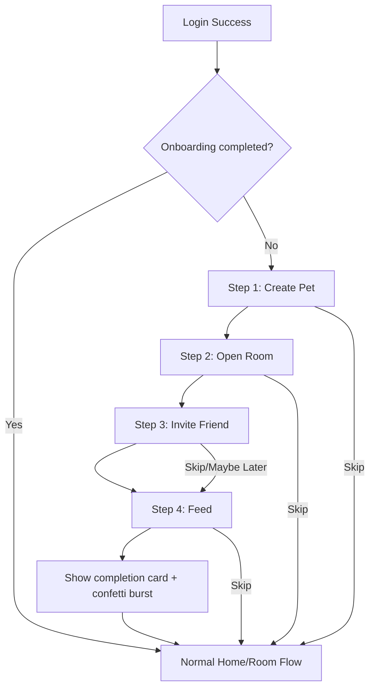

# Onboarding Basic Tutorial Spec (Game Style, Lightweight)

> Note (2026-03-01): Production onboarding v1 has removed Step 2 ("Enter/open room"). Current runtime flow is Create Pet -> Invite Friend -> Feed Once.

## Goal
Guide first-login users through the minimum core loop with a simple in-product coach flow (no mission system):
1. Create pet
2. Enter/open room
3. Invite friend
4. Feed once

## Activation Definition
A user is considered activated when all 4 tutorial steps are complete, with special focus on the first feed success.

## UX Direction (Match Current Game Style)
- Use a pet-voice bottom coach card with short, playful copy.
- Use one highlight target per step (spotlight + dimmed background).
- Keep current visual language: warm cream background, soft green primary, rounded chips/cards, light bouncy transitions.
- Every step includes `Skip` and can be resumed later from where the user stopped.

## Flow Overview



## Step-by-Step Script

### Step 1: Create Pet
- Trigger: first login with no completed onboarding.
- Screen context: room selection.
- Highlight target: primary create CTA.
- Coach copy: `先建立你第一隻寵物。`
- Completion condition:
  - room created successfully and pet selection returned, or
  - app detects at least one room with valid pet.

### Step 2: Open Room
- Trigger: Step 1 complete.
- Screen context: room selection.
- Highlight target: created room card tap area.
- Coach copy: `撳入房間，開始照顧佢。`
- Completion condition: room entry completed (`_showRoomSelection == false` and active room id set).
- Note: if create flow auto-enters room, this step auto-completes instantly.

### Step 3: Invite Friend
- Trigger: Step 2 complete.
- Screen context: home status bar.
- Highlight target: invite chip/button.
- Coach copy: `撳呢度產生邀請碼，Send 俾朋友加入。`
- Completion condition: invite code generated successfully and invite dialog displayed once.
- Secondary action: `稍後再邀請` (marks this step skipped but keeps onboarding flow moving).

### Step 4: Feed
- Trigger: Step 3 complete or skipped.
- Screen context: home bottom nav then feed screen.
- Highlight target sequence:
  - home camera nav button
  - feed send button
- Coach copy: `最後一步，幫寵物餵第一餐！`
- Completion condition: feed send success callback fired (`onUploadCompleted`).

### Completion
- Completion card copy: `完成基本教學！你可以開始同朋友一齊養寵物。`
- Visual reward: lightweight burst animation (stars/confetti), no task rewards.

## State Schema (Flutter)

```dart
enum OnboardingStep {
  createPet,
  openRoom,
  inviteFriend,
  feedOnce,
  completed,
}

class OnboardingState {
  final OnboardingStep currentStep;
  final bool dismissed; // user skipped entire flow
  final bool completed;
  final DateTime? startedAt;
  final DateTime? completedAt;
  final Set<OnboardingStep> skippedSteps; // mainly invite step

  const OnboardingState({
    required this.currentStep,
    required this.dismissed,
    required this.completed,
    this.startedAt,
    this.completedAt,
    this.skippedSteps = const <OnboardingStep>{},
  });
}
```

### Suggested local persistence keys
Store in `AppSettingsRepository` Hive box:
- `onboarding_basic_current_step`
- `onboarding_basic_dismissed`
- `onboarding_basic_completed`
- `onboarding_basic_started_at_iso`
- `onboarding_basic_completed_at_iso`
- `onboarding_basic_skipped_steps`

## Anchor ID Map (Implementation Targets)

### Room Selection
- `onboarding.create_pet.cta`
  - File: `lib/features/home/room_selection_view.dart`
  - Widget target: `_buildPrimaryCta()` -> `InkWell(onTap: onCreateRoom)`
- `onboarding.open_room.card`
  - File: `lib/features/home/room_selection_view.dart`
  - Widget target: room card tap area -> `onSelectRoom(roomId)`

### Create Pet Dialog
- `onboarding.create_pet.name_input`
  - File: `lib/features/home/home_view_models.dart`
  - Widget target: `_RoomCreationDialog` -> `TextField(controller: _petController)`
- `onboarding.create_pet.confirm`
  - File: `lib/features/home/home_view_models.dart`
  - Widget target: `AppDialogAction.primary(label: l10n.roomCreateAction)`

### Home (In Room)
- `onboarding.invite.cta`
  - File: `lib/features/home/widgets/home_game_status_bar.dart`
  - Widget target: invite `_ActionChip(onTap: onInviteTap)`
- `onboarding.feed.camera_nav`
  - File: `lib/features/home/widgets/home_bottom_nav_bar.dart`
  - Widget target: `_CameraButton(onTap: onCamera)`

### Feed Screen
- `onboarding.feed.send`
  - File: `lib/features/feed/feed_capture_view.dart`
  - Widget target: `FilledButton(onPressed: _sendFeed)`

## Trigger and Resume Rules
- Start condition: authenticated user + `onboarding_basic_completed == false` + `onboarding_basic_dismissed == false`.
- Resume condition: app relaunch or background/foreground transition restores last `currentStep`.
- Auto-complete guard:
  - If user already has room/pet before coach appears, skip Step 1.
  - If user is already inside room, skip Step 2.
  - If invite has already been generated this session, skip Step 3.
- Exit condition: set `dismissed = true` when user taps `Skip tutorial`.

## Copy Set (Cantonese)
- Step 1: `先建立你第一隻寵物。`
- Step 2: `撳入房間，開始照顧佢。`
- Step 3: `撳呢度產生邀請碼，Send 俾朋友加入。`
- Step 4: `最後一步，幫寵物餵第一餐！`
- Complete: `完成基本教學！你可以開始同朋友一齊養寵物。`
- Actions: `下一步` / `稍後再邀請` / `跳過教學`

## Metrics Events (Recommended)
- `onboarding_basic_start`
- `onboarding_basic_step_shown` (param: `step`)
- `onboarding_basic_step_completed` (param: `step`)
- `onboarding_basic_step_skipped` (param: `step`)
- `onboarding_basic_completed`
- `onboarding_basic_dismissed`

## QA Checklist
- Step highlight aligns correctly on compact/regular/expanded layouts.
- Dismiss + resume works across app relaunch.
- Auto-skip works when user already completed underlying action.
- Feed step completion fires only on successful upload callback.
- Invite step `Later` does not block progression to feed step.
